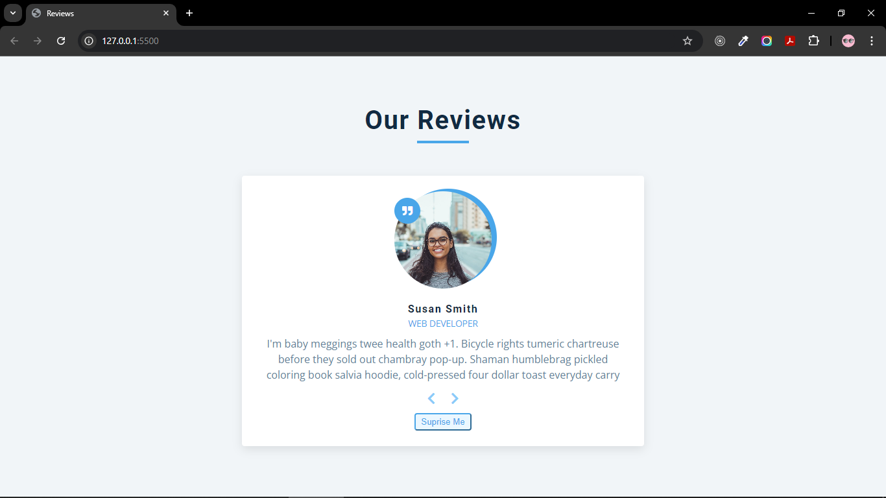
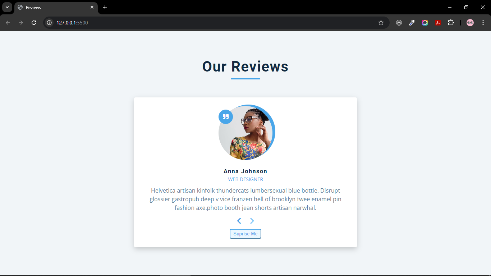
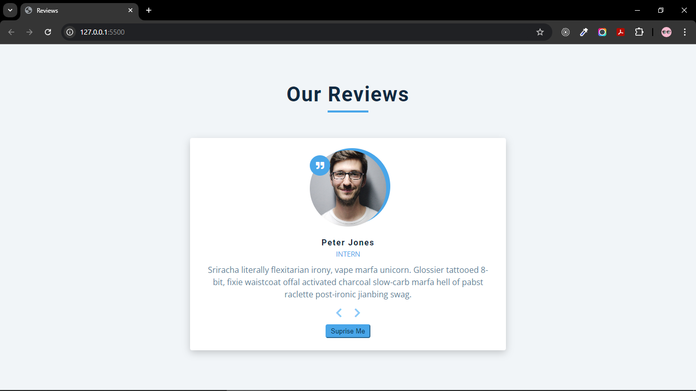

# Reviews

###### we will have reviews project were we can set back and forward button to change the review and also keep random button for random review

**Review**

**Review next-button**

**Review prev-button**

**Review Random Button**

###### Overhere we target the window object by add Event listener and use DOMContentLoaded to load asset and content then we work on function which will show the person then we will target the buttons by adding event listener according to the name of button

[backlink](../ReadMe.md)